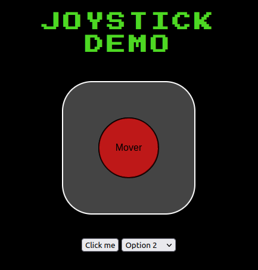

# Proyecto orsai Insta360 control

> 🚧 PROYECTO EN DESARROLLO

Este proyecto tiene como objetivo permitir el control remoto de una cámara equipada con un gimbal utilizando un servicio web. El sistema permitirá a los usuarios acceder a la cámara y controlar su movimiento y ajustes desde cualquier ubicación dentro de una red local.



---
## 🏌️‍♂️ **Current release**

La versión actual del software fue desarrollada para una Raspberry Pi 4 B (2GB). Requiere de una fuente de alimentación de 5v 3a y una memoria SD de 16GB. Instalar un sistema operativo Raspberry Pi OS (32-bits) Debian Bullseye [2023-05-03].

## 🌱 Instalación

> 🧉 Si ya tenes la RPi instalada y configurada dirigite al paso Getting started

* Actualización de SO:
``` bash
    sudo apt-get update
    sudo apt-get upgrate
```

* Instalación de los siguientes drivers:
``` bash
    sudo apt-get install v4l-utils # Importante!
    sudo apt-get install guvcview # GUI para visualizar cámara (opcional)
```

* Listar los puertos usb y encontrar el que tenga a Insta360:
``` bash
    lsusb
    v4l2-ctl --list-device # para saber en que /dev esta
    v4l2-ctl --list-formats-ext -d <Numero del device>  #Lista los formatos compatibles
```

* Algunos comandos útiles son:
``` bash
    v4l2-ctl --list  # enlista todos los tipos de comandos disponibles
    v4l2-ctl --list-ctrls  # enlsita todos los comandos de controles
    v4l2-ctl -d /dev/video0 --get-ctrl=pan_absolute  # Ejemplo de obtener el valor de pan actual
```

🚀 **Getting started**

* Clonar repositorio.
``` bash
    git clone https://github.com/orsai-tech/orsai-insta360.git
```
* 
``` bash
    cd app
    python3 -m venv env
    source env/bin/activate
    pip install -r requirements.txt
    python3 app.py
```

## 🪜 **Características del release**

- Creación y gestión de listas de tareas.

## Capturas de Pantalla

- Inserta aquí capturas de pantalla del diseño de la interfaz de usuario de la aplicación.


## Uso

- La descripción del uso.

## Contribución

Si deseas contribuir al proyecto, sigue estos pasos:

1. Haz un fork del repositorio orsai-insta360 en GitHub.
2. Crea una rama para tu contribución: `git checkout -b feature/nueva-caracteristica`.
3. Realiza los cambios y mejoras necesarias.
4. Asegúrate de ejecutar las pruebas y comprobar que todo funciona correctamente.
5. Envía una solicitud de extracción (Pull Request) describiendo tus cambios.

## Autores

[ORSAI](https://orsai.org/) + [MEC](https://mecantronic.com.ar/)

## Licencia

- Este proyecto se distribuye bajo la Licencia MIT. Consulta el archivo LICENSE para más información.
